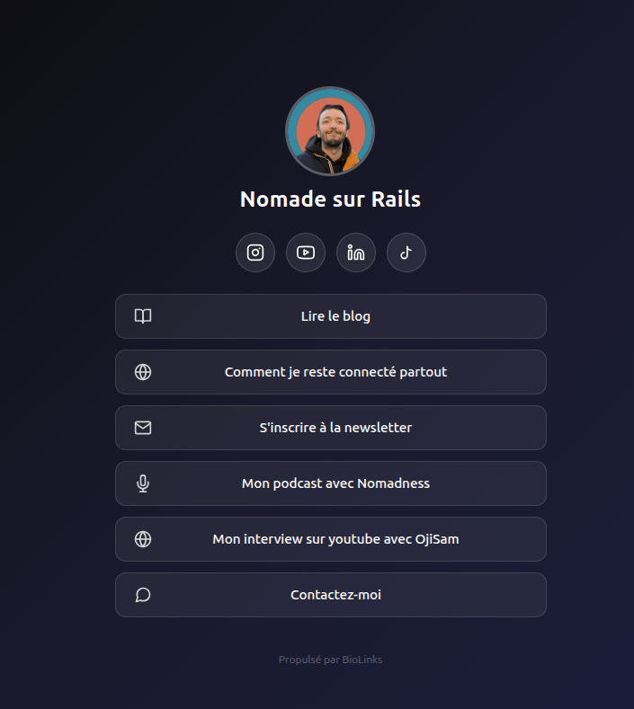
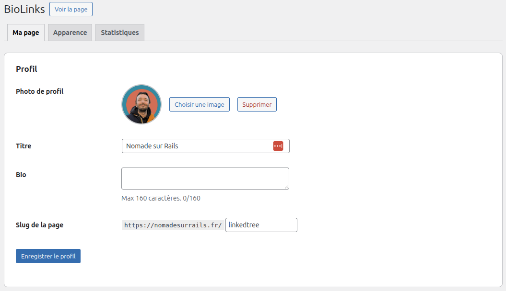
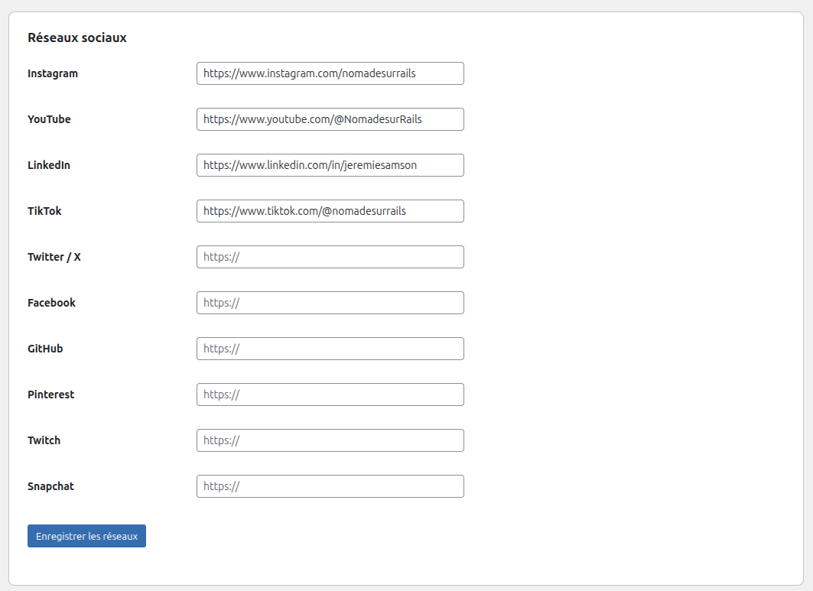
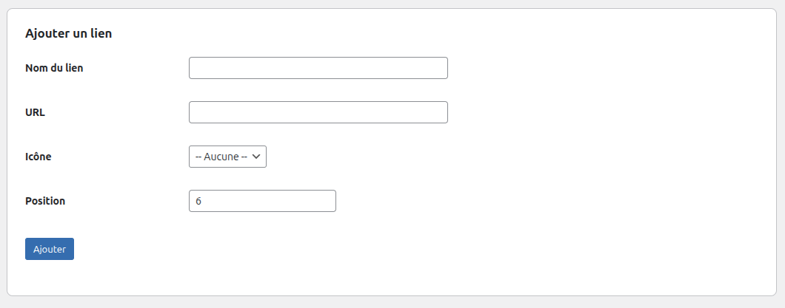
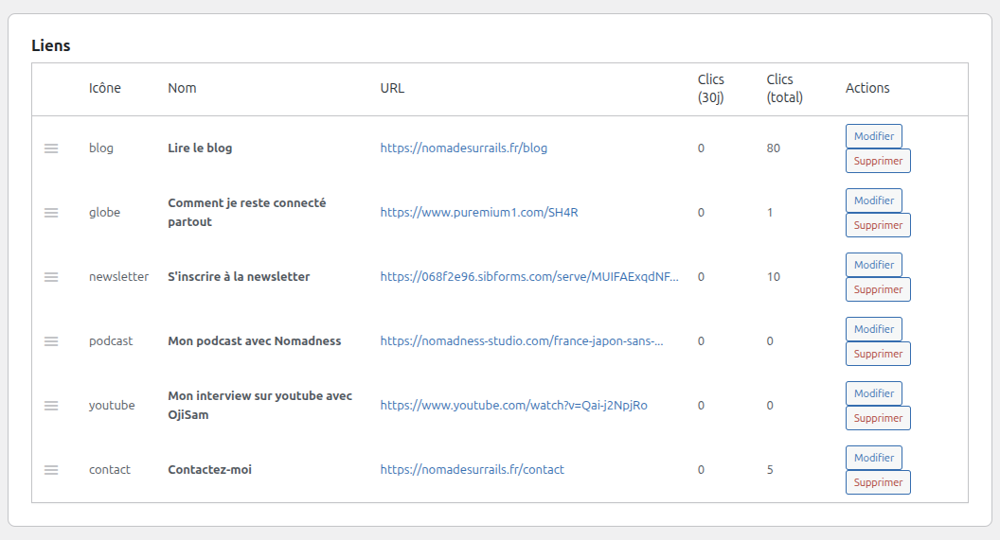
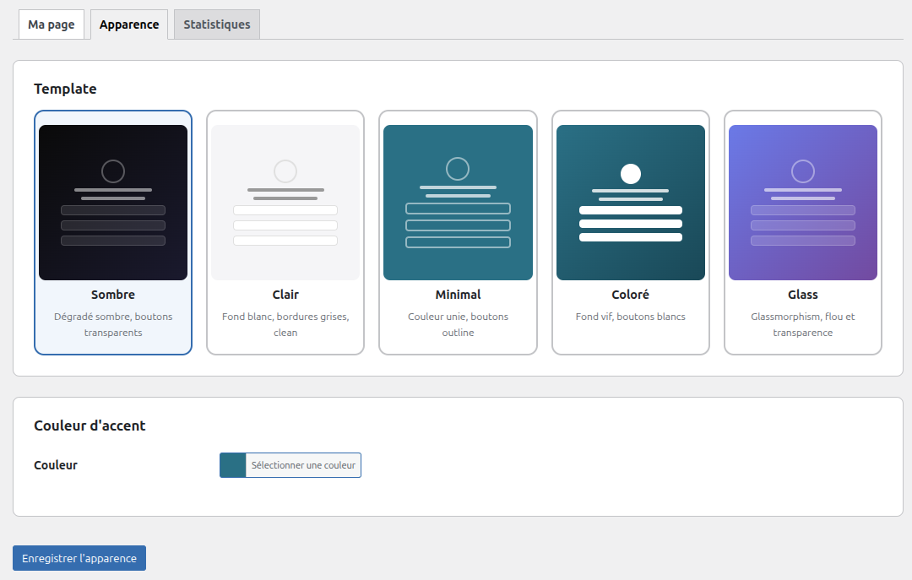
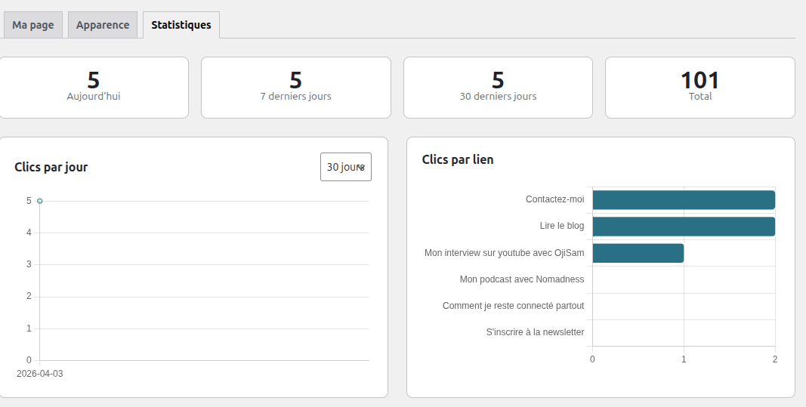

# BioLinks — WordPress Link in Bio Plugin

**Create a beautiful, self-hosted link in bio page on your own WordPress site.**

No third-party accounts. No subscriptions. No limits. Just a free, open-source plugin that gets the job done.

---

## Features

- **5 visual templates** — Dark, Light, Minimal, Colorful, Glassmorphism
- **Custom accent color** — Native WordPress color picker to match your brand
- **Social media icons** — Instagram, YouTube, TikTok, LinkedIn, Twitter/X, Facebook, GitHub, Pinterest, Twitch, Snapchat — SVG icons displayed automatically
- **Click tracking** — Built-in analytics with daily charts and per-link stats, right inside your WordPress admin
- **Google Analytics auto-detection** — Works with SEOPress, Yoast, and MonsterInsights out of the box
- **Standalone page** — No theme header/footer, works with any WordPress theme
- **Zero external dependencies** — Everything hosted on your server. No CDN, no cookies, no third-party tracking. GDPR friendly by design.
- **Drag & drop link ordering** — Reorder your links with a simple drag and drop
- **Media Library integration** — Upload your profile photo directly from the WordPress media library

## Requirements

- WordPress 5.9+
- PHP 8.0+

## Installation

1. Download the latest release ZIP from the [Releases page](https://github.com/JeremieSamson/biolinks/releases)
2. In your WordPress admin, go to **Plugins > Add New > Upload Plugin**
3. Select the ZIP file and click **Install Now**
4. Activate the plugin — your page is created automatically at `/links/`
5. Go to **BioLinks** in the admin menu to configure your links, photo, and template

---

## Screenshots

### Profile configuration

Set your profile photo (via WordPress Media Library), display name, bio (max 160 characters), and customize the page slug.

### Social networks

Enter the URL for each social network you use. Only filled networks are displayed as icons on your page. Supports Instagram, YouTube, LinkedIn, TikTok, Twitter/X, Facebook, GitHub, Pinterest, Twitch, and Snapchat.

### Add a link

Add links with a name, URL, optional icon, and position. Icons include globe, blog, contact, podcast, newsletter, music, video, shop, and link.

### Manage your links

View all your links with click stats (30-day and total). Reorder with drag & drop, edit or delete any link. The drag handle on the left lets you reorder instantly.

### Appearance

Choose from 5 visual templates and pick a custom accent color to match your brand. The template preview shows you what each style looks like before you select it.

### Statistics

Track your link performance with daily click charts and per-link breakdown. Filter by period (7, 30, or 90 days). Stats cards show clicks today, this week, this month, and total.

---

## Templates

| Template | Description |
|----------|-------------|
| **Dark** | Dark gradient background, semi-transparent buttons, white text |
| **Light** | White/light gray background, bordered buttons, dark text |
| **Minimal** | Solid accent color background, white outline buttons |
| **Colorful** | Vibrant accent background, white buttons with accent text |
| **Glass** | Blurred background, glassmorphism effect buttons |

## Frequently Asked Questions

### Is BioLinks really free?

Yes, 100%. No premium version, no locked features. The full plugin, forever.

### What's the difference with Linktree?

Linktree hosts your page on their domain (linktr.ee). With BioLinks, your page lives on your own WordPress site. You keep full control over design, data, and SEO.

### Is it compatible with my WordPress theme?

BioLinks generates a standalone page without your theme's header or footer. It works with any WordPress theme.

### Can I customize the design?

Choose from 5 templates and customize the accent color. For advanced customization, you can add custom CSS in the WordPress customizer.

## Contributing

Contributions are welcome! Feel free to open an issue or submit a pull request.

## Credits

Built by [Jeremie Samson](https://nomadesurrails.fr) — digital nomad, train traveler, and WordPress developer.

## License

GPLv2 or later. See [LICENSE](LICENSE) for details.
